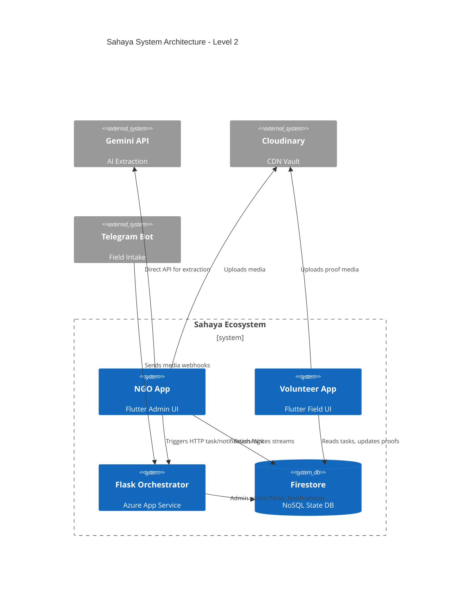

### 1. SYSTEM SUMMARY
Sahaya is an AI-driven disaster response and community empowerment platform bridging NGOs with localized volunteers. NGOs utilize a Flutter-based mobile dashboard to ingest field data (via app uploads or a Telegram bot), which Google Gemini AI transforms into structured `problem_cards` and actionable `tasks`. Volunteers use a dedicated mobile interface to discover local missions, accept tasks, execute actions, and submit cryptographic/visual proof. A Python Flask backend hosted on Azure orchestrates automated task matching, Telegram webhook processing, and push notifications, while Firebase handles all real-time state, authentication, and structured data storage.

### 2. COMPONENT INVENTORY
- **NGO App (Flutter)**: Role: Admin interface. Inputs: NGO actions, manual data, media. Outputs: Firestore records, Cloudinary URLs.
- **Volunteer App (Flutter)**: Role: Field execution. Inputs: Location, user action, proof photos. Outputs: `match_records` updates.
- **Flask Backend (Azure)**: Role: Orchestration. Inputs: HTTP webhooks (Telegram, manual triggers). Outputs: Generated tasks, notifications. Dependencies: Firebase Admin, Telegram API.
- **Google Gemini (AI Engine)**: Role: Data extraction. Inputs: Raw text/images/audio. Outputs: JSON structured `problem_cards`.
- **Telegram Bot**: Role: Agile field intake. Inputs: Media/Text from anyone. Outputs: Webhook payloads to Azure.
- **Cloudinary**: Role: Media storage. Inputs: Image/video blobs. Outputs: CDN URLs.
- **Firebase Auth**: Role: Identity provider. Inputs: Credentials. Outputs: Auth tokens.
- **Firestore DB**: Role: State/Storage. Inputs: App/Backend operations. Outputs: Real-time streams.

### 3. ARCHITECTURE DIAGRAM

### 4. DATA FLOW SUMMARY
- **Ingestion**: NGO/Bot captures media → Upload to Cloudinary → `raw_uploads` doc created in Firestore.
- **Extraction**: NGO taps 'Extract' → Gemini parses media → Returns JSON `problem_cards` (status: pending_review).
- **Task Generation**: NGO approves card → Calls Azure HTTP endpoint → Backend splices problem into `tasks` and assigns `priorityScore`.
- **Matching**: Volunteer logs in → Location queried → Stream filters eligible tasks in radius → Volunteer accepts → Creates `match_records`.
- **Proof & Review**: Volunteer completes task → Uploads proof to Cloudinary → Appends `proof` to `match_records` → Triggers Azure HTTP notify → Creates `ngo_notifications` → NGO approves/rejects proof.

### 5. KEY WORKFLOWS
**1. Field Issue Reporting**
- NGO or Telegram captures unstructured data.
- Payload hits backend or Cloudinary.
- `raw_uploads` document initialized `pending`.

**2. AI Extraction & Structuring**
- NGO triggers Gemini analysis.
- Multi-modal prompt analyzes severity, scale, issue classification.
- `problem_cards` document generated for manual review.

**3. Volunteer Micro-Tasking**
- Problem card approved.
- Azure splits card into actionable micro-tasks.
- Volunteer accepts task → directions opened via Maps Intent → `match_records` instantiates.

**4. Proof Validation**
- Volunteer uploads post-completion images.
- Cloudinary saves image.
- Status updates to `proof_submitted`.
- NGO checks queue, rejects (with feedback) or approves to close out logic.

### 6. DETAILED USE CASE (Most Critical)
**Name**: Volunteer Task Lifecycle & Verification
- **Actors**: Volunteer, NGO Admin
- **Preconditions**: Tasks correctly generated in DB, Volunteer authenticated.
- **Flow**:
  1. Volunteer browses `Available Tasks` near their location.
  2. Selects task and chooses "Accept Mission" → changes status.
  3. App routes directions via external Google Maps intent.
  4. Volunteer completes work, opens "Submit Proof" bottom sheet.
  5. Takes camera photo → uploads to Cloudinary → URL patched to Firestore.
  6. Azure backend creates unread `ngo_notifications` element via HTTP trigger.
  7. NGO Admin banner pops up -> clicks Review Proof -> validates visually.
  8. NGO approves: Task marked `proof_approved`, Volunteer gains impact score.

### 7. FEATURE MATRIX

| Feature | Component(s) | Description |
|---|---|---|
| Role-based Dashboards | Flutter | Separate NGO / Volunteer UIs |
| AI Data Extraction | Flutter + Gemini | Turns photos/audio into structured problem data |
| Telegram Webhook | Azure + Telegram | Receives media from field reporters automatically |
| Task Delegation | Azure Backend | Breaks large problems down to manageable tasks |
| Geo-Matching | Flutter | Links volunteer location to task coordinates |
| Proof Validation | Flutter + Firestore | Evidence submission to finish lifecycle |
| Cloud Storage | Cloudinary | Hosts raw ingestion and proof imagery |
| Realtime Notifications | Firestore + Flutter | Stream listeners popping alert banners |

### 8. API + INTEGRATION MAP
- **Internal APIs**:
  - `POST /telegram-webhook`: Parses Telegram bots, uploads media, stages raw.
  - `POST /process-tasks`: Translates approved problem cards into task splits.
  - `POST /notify-proof-submitted`: Alerts NGO on volunteer proof completion.
  - `POST /notify-proof-rejected`: Pushes rejection feedback.
- **External APIs**:
  - `Google Gemini API` (`google_generative_ai`): Multimodal prompt engineering.
  - `Cloudinary SDK`: Direct upload presets via HTTP.
  - `Telegram API`: Webhook integration (`api.telegram.org/bot<TOKEN>`).
  - `Firebase SDKs`: Auth, Firestore transactions.

### 9. DATA MODEL
- **users (Volunteers)**: `uid`, `name`, `score`, `locationGeoPoint`
- **ngo_profiles**: `id`, `name`, `email`
- **raw_uploads**: `id`, `ngoId`, `type`, `url`, `status`
- **problem_cards**: `id`, `ngoId`, `issueType`, `severityLevel`, `priorityScore`, `status`
- **tasks**: `id`, `problemCardId`, `description`, `requiredVolunteers`, `status`
- **match_records**: `id`, `taskId`, `volunteerId`, `status`, `proof` (map)
- **ngo_notifications**: `id`, `ngoId`, `type`, `matchRecordId`, `read`

### 10. SCALABILITY + BOTTLENECKS
- **Gemini Rate Limits**: Direct client calls to Gemini risk quota bottlenecks on scaling.
- **Client-Side Heavy DB Queries**: Excessive Firestore reading due to local filtering rather than server-side indexing.
- **File Upload Times**: Synchronous media uploads can block UI; switch to background.
- **Map Geocoding Limits**: No heavy clustering, purely linear radial queries [ASSUMED].
- **Cold Booting**: Azure App Service Free tier sleeps, delaying task/webhook parsing initially.

### 11. SECURITY CONSIDERATIONS
- **Firestore Roles**: Ensure `rules` are locked. Volunteers cannot read arbitrary NGO logs.
- **Exposed Keys**: Make sure API keys (`BACKEND_URL`, Cloudinary keys) are strictly kept in git ignored `.env`.
- **Telegram Webhook Verification**: Ensure secret tokens exist so external bad actors cannot POST fake payloads.
- **Input Validation**: Null safety handling and explicit regex checks on backend payloads.
- **Cloudinary Abuse**: Malicious signed uploads can saturate CDN unless restricted to signed backend generation limiters.

### 12. MISSING / NEXT FEATURES
1. **Push Notifications (FCM)**: Transition from active Firestore streams to proper background device Push Notifications.
2. **Backend Authentication**: Secure Azure HTTP routes via Bearer Tokens matching Firebase Admin UID.
3. **Task Clustering (Geospatial)**: Use geohashes to properly optimize local assignment filtering at scale.
4. **Server-Side AI Logic**: Move Gemini prompting from Flutter to Azure to hide prompts and API keys securely.