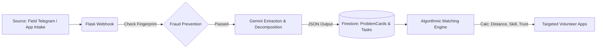

<div align="center">
  <h1>🤝 Sahaya</h1>
  <p><strong>A Next-Generation AI-Driven NGO Operations & Volunteer Mobilization Platform.</strong></p>
  <p><i>Built for the Google Solution Challenge 2026</i></p>

  [](https://flutter.dev/)
  [](https://firebase.google.com/)
  [](https://flask.palletsprojects.com/)
  [](https://ai.google.dev/)
</div>

<br/>

## 🌍 The Mission
During crises or daily operations, NGOs face massive logistical bottlenecks. Data comes in chaotically (WhatsApp, phone calls, frantic texts), classifying tasks is mostly manual, and matching available volunteers manually is incredibly slow.

**Sahaya** bridges the gap between chaotic on-the-ground reporting and intelligent, organized volunteer mobilization. We ingest raw field data through Telegram/App uploads, use AI to abstract it into actionable micro-tasks, and operationally route those tasks to the absolute best volunteer based on precise mathematical parameters. 

---

## ✨ Key Features

### 🏛️ For NGOs (Command Center)
- **AI Task Abstraction:** Turn a single paragraph of text (or an audio note) into 3-4 structured, manageable tasks with estimated completion times using Google Gemini AI.
- **KPI Dashboards & Heatmaps:** Get a bird's-eye view of your impact operations, geographical problem concentrations, and task success rates.
- **Simulation Engine:** Predict SLA delays and coverage risks ahead of time by simulating "What if volunteer availability drops by 40%?".
- **Autonomous Proof Verification:** Gemini Vision AI autonomously scales submitted volunteer evidence (like photos of fixed pipes) to check if the exact task parameters were met, massively reducing manual admin overhead.

### 🏃 For Volunteers (Field App)
- **Hyper-Personalized Matching:** You don't scroll through lists. The Engine pushes notifications directly to you calculated via **Haversine Distance**, **Skill Matching**, **Availability Windows**, and **Historical Trust Scores**.
- **Offline-First Resilience:** In extreme low-connectivity zones, volunteers can accept tasks, finish them, and attach rich media proofs directly to a hardened local offline queue that flawlessly syncs using `server_wins` resolution once cellular networks are restored.
- **Auto-Redispatch Security:** Can't make the task? Sahaya's backend automatically expires stale task acceptances to organically route the task to the *next* best volunteer without NGO intervention.

---

## 🛠 Tech Stack 

- **Frontend & Field Clients:** Flutter (Dart). Uses `flavorizr` to split the binary into exclusive `NGO` and `Volunteer` bundles. 
- **AI & NLP Ecosystem:** Google `genai` (`gemini-flash-lite-latest`), ML Kit Text Recognition on-device pipeline.
- **Backend Services:** Python 3 Flask API acting as a serverless-friendly FaaS webhook, managed chronologically via `APScheduler`.
- **Database & Identity:** Firebase (Firestore NoSQL, Auth, Cloud Messaging).
- **Blob & Media:** Cloudinary and Azure Webhooks for robust network handling outside native architectures.

---

## 🏗️ High-Level Data Flow



---

## 🚀 Quick Start / How to Run Locally

### 1. Backend Webhook (Python/Flask)
You will need your `.env` populated with `GEMINI_API_KEY`, `FIREBASE_CREDENTIALS`, and `CLOUDINARY` secrets.
```bash
cd services/telegram-webhook
python -m venv venv

# Activate Environment
# Windows: venv\Scripts\activate 
# Mac/Linux: source venv/bin/activate

pip install -r requirements.txt
python app.py
```
*Note: This runs locally on port 5000. Use Ngrok to expose this port to Telegram/Azure webhooks if testing end-to-end integration.*

### 2. Frontend Applications (Flutter)
Ensure you have Flutter version `^3.11.4` installed. We use flavors to separate the app bundles.

```bash
# Get all dependencies
flutter pub get

# To launch the NGO Command Center:
flutter run --flavor ngo -t lib/main_ngo.dart

# To launch the Volunteer Field application:
flutter run --flavor volunteer -t lib/main_volunteer.dart
```

---

## 🛡️ Privacy & Fraud Guardrails 
- **Duplicate Uploads:** Upload media/texts are hashed via `SHA-256`. Identical event reporting from multiple field workers is deduplicated to prevent database pollution.
- **Volunteer Gaming Prevention:** A Trust Scoring system dynamically governs bounds. High-risk or complex tasks strictly demand volunteers who have passed continuous reliability checks.

<br/>

<div align="center">
  <i>Empowering Civic Action Through Artificial Intelligence.</i>
</div>
