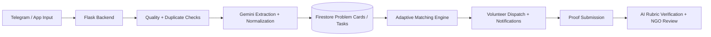
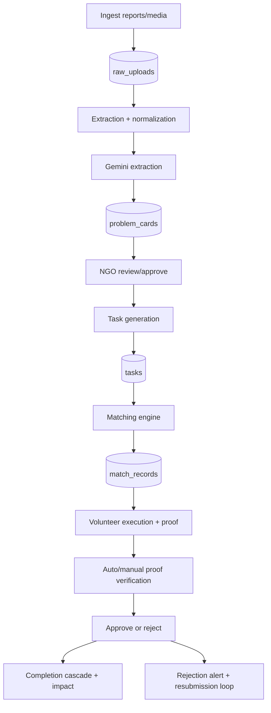
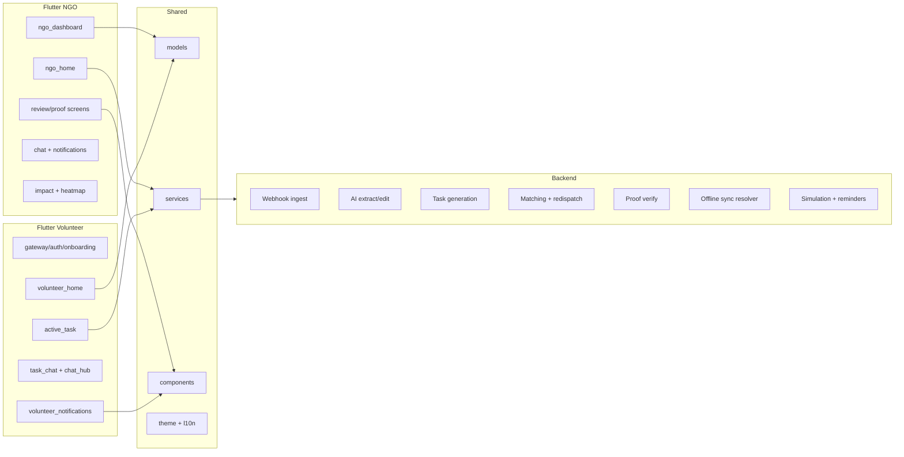
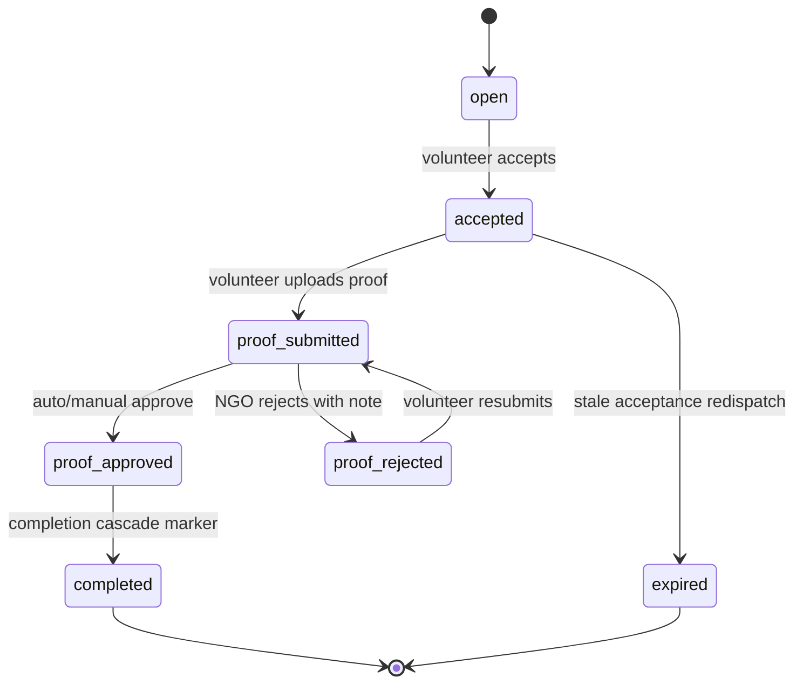

<div align="center">
  <h1>Sahaya</h1>
  <p><strong>AI-Driven NGO Operations and Volunteer Mobilization Platform</strong></p>
  <p><i>Google Solution Challenge 2026 Submission</i></p>

  [](https://flutter.dev/)
  [](https://firebase.google.com/)
  [](https://flask.palletsprojects.com/)
  [](https://ai.google.dev/)
</div>

## Problem Statement: Smart Resource Allocation
Local social groups and NGOs collect critical community-needs data through surveys, field reports, and media. This data is fragmented across sources, making urgent priorities difficult to identify and slowing volunteer response.

Sahaya unifies scattered community data, ranks urgency, and coordinates data-driven volunteer deployment to the exact tasks and localities where impact is highest.

## Objective
Design and operate a production-ready system that:
1. Aggregates fragmented community inputs into structured, actionable intelligence.
2. Identifies urgent local needs with transparent prioritization.
3. Matches available volunteers to task requirements using explainable scoring.
4. Closes the loop with verification, feedback, and measurable impact metrics.

## What Sahaya Does
1. Ingests field reports from Telegram and app clients.
2. Uses AI to extract structured problem cards and decomposes them into executable tasks.
3. Calculates priority and dispatches tasks using skill, distance, availability, language, and trust signals.
4. Supports real-time team coordination through role-specific chat and notifications.
5. Verifies completion proof with AI rubric scoring and human-in-the-loop fallback.

## Latest Implemented Updates
### Communication and Coordination
- Dedicated chat hub for both Volunteer and NGO roles.
- Thread-level unread tracking with read receipts per task.
- In-app notification centers for both roles.
- Unread indicators in dashboard, hub, and notification views.
- Member detail sheet for task-level coordination chats.

### SDG-17 Alignment
- Problem classification migrated to full SDG 1-17 taxonomy.
- SDG labels now drive type selection and on-card SDG display.
- Legacy issue-type compatibility maintained through normalization.

### AI Reliability and Safety
- AI edit responses are schema-sanitized before persistence.
- Batch AI task refactor is constrained by allowed task schema and skill taxonomy.
- AI extraction outputs are normalized and bounded before storage.

### Proof Verification Intelligence
- Proof verification upgraded from single confidence score to rubric scoring:
  - taskEvidenceScore
  - clarityScore
  - geoTemporalPlausibilityScore
  - tamperRiskScore
- Auto-approval now uses rubric-weighted confidence and tamper safeguards.

### Rejection and Resubmission UX
- Volunteer Active Mission flow now preserves NGO rejection context with inline admin feedback notes.
- Rejected proof records now surface as explicit "resubmission required" alerts in volunteer notifications.
- Volunteer notification badges now include unread proof-rejected alerts to prevent missed follow-up.

### Firestore Query Reliability
- Reduced composite-index dependency across high-traffic NGO and volunteer screens by shifting safe filters/sorts to client-side post owner-scoped queries.
- Preserved user-visible behavior while lowering index churn risk during rapid iteration.

### Matching and Dispatch Improvements
- Adaptive match weighting based on historical outcome signals.
- Explainable match factors persisted for auditability.
- Stale acceptance redispatch loop for operational resilience.

### Duplicate and Quality Controls
- Fingerprint-based duplicate detection for uploads.
- Near-duplicate clustering for problem cards using issue/location/text similarity.
- Quality event logging for anomaly review.

### Voice AI Pipeline
- Voice extraction path implemented end-to-end with dedicated backend audio endpoint.

## Key Features
### NGO Command Center
- AI extraction from text, document, image, and audio inputs.
- AI-assisted single-card editing and batch task refactoring.
- Priority scoring with component breakdown (severity, scale, recency, gap).
- Review queue with proof verification workflow.
- Impact dashboards, heatmaps, and scenario simulation.

### Volunteer Field App
- Personalized matching with explainable dispatch logic.
- Task lifecycle actions with offline-sync conflict handling.
- Proof submission and status feedback loop.
- Rejection-aware proof resubmission workflow with actionable admin comments.
- Real-time team chat and role-aware notifications.

## Architecture Snapshot


## Architecture References
- Full technical deep dive: [SYSTEM_ARCHITECTURE.md](SYSTEM_ARCHITECTURE.md)
- Presentation-ready slide pack: [SYSTEM_ARCHITECTURE_SLIDES.md](SYSTEM_ARCHITECTURE_SLIDES.md)

## Additional Architecture Diagrams
### Operational Loop (Detailed)


### Core Components


### Match Lifecycle State Machine


## Engineering Highlights
### Technical Depth
#### Technical Complexity
- Multi-channel ingestion (text, media, Telegram, voice) and structured decomposition into problem cards and tasks.
- End-to-end lifecycle pipeline: extraction, prioritization, matching, dispatch, chat coordination, proof verification, completion cascade.
- Real-time bidirectional role architecture (NGO and Volunteer) with shared task state and read-receipt consistency.

#### AI Integration
- AI is used where deterministic rules are insufficient:
  - unstructured extraction to structured JSON,
  - natural-language editing for cards/tasks,
  - proof verification rubric scoring.
- Deterministic controls are enforced around AI outputs:
  - schema sanitization,
  - bounded value normalization,
  - constrained task taxonomies.

#### Performance and Scalability
- Firestore stream-based UI updates reduce manual refresh overhead.
- Batch writes and idempotent generation patterns reduce duplicate operations.
- Adaptive matching weights learn from outcomes while preserving bounded scoring.
- Containerized backend deployment supports rapid iteration, horizontal scaling, and rolling updates across cloud runtimes.

#### Security and Privacy
- Duplicate and anomaly controls: fingerprints, near-duplicate detection, quality event logs.
- Trust-aware volunteer gating and redispatch safeguards.
- Explicit offline sync conflict policy with audit logging (`server_wins` + conflict record).
- Data minimization in extraction flow through anonymized descriptions.

### User Experience
#### Design and Navigation
- Role-specific app flavors prevent cross-role UI noise and reduce cognitive load.
- High-frequency workflows are one-tap accessible: chat hub, unread indicators, review queue, AI assist actions.

#### User Flow
- NGO flow: intake -> extraction -> review -> task generation -> dispatch -> proof review -> completion.
- Volunteer flow: receive match -> accept/execute -> submit proof -> coordinate in chat -> completion feedback.
- Reduced friction via in-context AI edits and batch task refactor tools.

#### Accessibility
- Clear visual hierarchy, status badges, and explicit labels across critical operations.
- Localization-ready text wrappers and consistent interaction patterns across both app flavors.

### Problem-Solution Fit
#### Problem Definition
- Directly targets real NGO bottlenecks: fragmented data, slow triage, delayed dispatch, and verification burden.

#### Relevance of Solution
- Every major module maps to the stated challenge:
  - data consolidation,
  - urgency scoring,
  - resource matching,
  - verified execution.

#### Expected Impact
- Expected improvements include reduced dispatch latency, faster issue closure, lower manual review load, and higher volunteer-task fit quality.

### Innovation
#### Originality
- Combines civic operations tooling, AI extraction, explainable matching, and trust-based verification into a single operational loop.

#### Creative Use of Technologies
- Uses Gemini for structured extraction and controlled edits while preserving deterministic governance.
- Integrates Firebase real-time coordination with cloud-hosted backend orchestration.

#### Future Potential
- Built with extensible taxonomies, explainability traces, and operational metrics to support city-level rollout and policy-grade reporting.

## Impact Measurement Framework
Sahaya tracks measurable operational outcomes for real-world deployments:
1. Time-to-triage: report ingestion to approved problem card.
2. Time-to-dispatch: approved task to volunteer acceptance.
3. Match quality: acceptance rate and proof approval rate by match score band.
4. Completion velocity: median task completion duration by SDG category.
5. Manual review reduction: ratio of auto-approved proofs vs manual reviews.
6. Duplicate suppression rate: blocked duplicate/near-duplicate submissions.

## Roadmap and Future Potential
1. Model evaluation dashboards for extraction and proof rubric drift.
2. Deeper accessibility compliance (screen-reader-first audits and action semantics).
3. Cost-aware autoscaling strategy across backend workloads.
4. Regional language expansion and voice-first intake optimization.
5. NGO-level policy insights with longitudinal SDG trend analytics.

## Technology Stack
- Frontend: Flutter (Dart), role flavors (`ngo`, `volunteer`).
- Backend: Python Flask (containerized, cloud-deployable).
- AI: Google Gemini (`gemini-flash-lite-latest`).
- Data: Firebase Firestore, Firebase Auth, Firebase Cloud Messaging.
- Media: Cloudinary.
- Scheduling: APScheduler.

## Local Development
### Backend (Flask)
Required environment variables include `GEMINI_API_KEY`, Firebase credentials, and Cloudinary secrets.

```bash
cd services/telegram-webhook
python -m venv venv

# Windows
venv\Scripts\activate

# macOS/Linux
# source venv/bin/activate

pip install -r requirements.txt
python app.py
```

### Flutter Apps
```bash
flutter pub get

# NGO app
flutter run --flavor ngo -t lib/main_ngo.dart

# Volunteer app
flutter run --flavor volunteer -t lib/main_volunteer.dart
```

## Production Deployment (Cloud-Native, Platform Agnostic)
Sahaya deploys as a containerized backend service behind HTTPS with environment-based configuration and health checks.

```bash
cd services/telegram-webhook

# Build container image
docker build -t sahaya-backend:latest .

# Push image to your container registry
docker tag sahaya-backend:latest <registry>/sahaya-backend:latest
docker push <registry>/sahaya-backend:latest

# Deploy latest image to your managed container platform
# (Cloud Run / ECS / Kubernetes / similar)

# Verify readiness endpoint
curl https://<your-domain>/health
```

Recommendation: use an always-on paid plan for production reliability, stable cold-start behavior, and predictable SLA.

## Security and Integrity Controls
- Upload fingerprinting and duplicate suppression.
- Volunteer trust-score-aware matching guardrails.
- Conflict logging for offline sync with explicit merge policy.
- Verification anomaly tracking and quality event audit trails.

## Deployment Confidence
Sahaya is designed for practical deployment with clear strengths across:
1. Technical depth and robust implementation.
2. Responsible and necessary AI integration.
3. Cause alignment with measurable social impact outcomes.
4. Innovation with clear pathway to long-term deployment.

<div align="center">
  <i>Operational intelligence for faster, safer, and more accountable civic response.</i>
</div>
