# Sahaya System Architecture Deep Dive

This document is a code-driven architecture analysis of Sahaya, based on the current implementation in:
- [lib](lib)
- [services/telegram-webhook](services/telegram-webhook)
- [firestore.rules](firestore.rules)
- [firebase.json](firebase.json)
- [pubspec.yaml](pubspec.yaml)

## 1. System Architecture Diagram (High-Level)

What this shows:
- Two role-based Flutter clients
- A Python Flask backend for orchestration and AI flows
- Firestore/Auth/FCM as core platform services
- External integrations (Gemini, Telegram, Cloudinary, optional cloud-platform webhook)

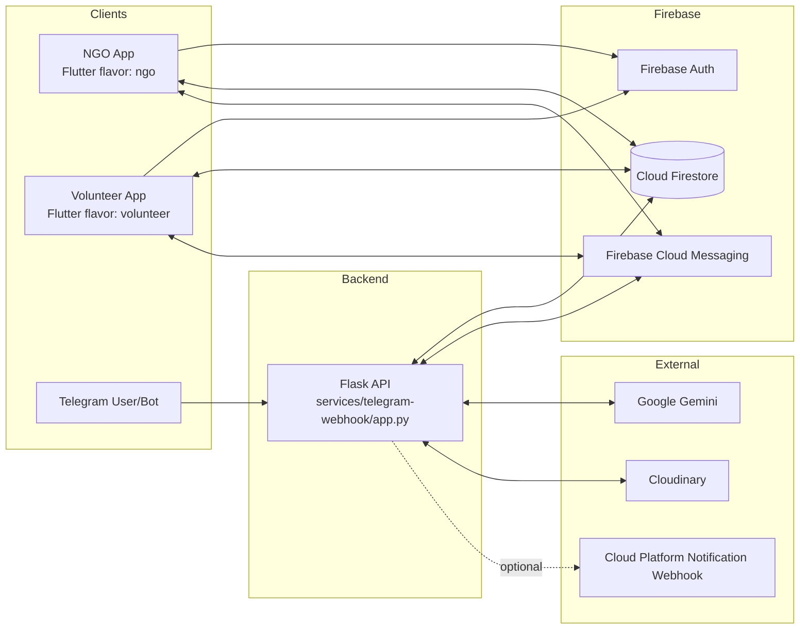

## 2. System Architecture Diagram (Detailed)

What this shows:
- End-to-end operational loop from intake to completion
- Where AI, deterministic scoring, and notifications are applied

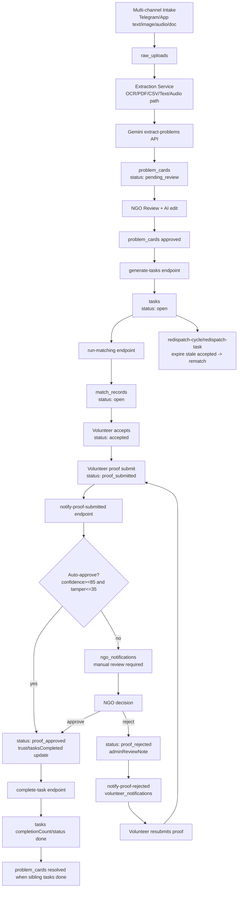

Example:
- Proof rejection now loops the volunteer back with admin note and explicit resubmission notification, rather than silently resetting progress.

## 3. Component Diagram

```mermaid
flowchart LR
    subgraph Flutter NGO
      NGO_D[ngo_dashboard]
      NGO_H[ngo_home_screen]
      NGO_R[review_queue/proof screens]
      NGO_C[ngo_chat_hub + notifications]
      NGO_I[impact + heatmap + monitor]
    end

    subgraph Flutter Volunteer
      VOL_G[volunteer_gateway/auth/onboarding]
      VOL_H[volunteer_home_screen]
      VOL_A[active_task_screen]
      VOL_C[task_chat + chat_hub]
      VOL_N[volunteer_notifications]
    end

    subgraph Shared UI/Logic
      COMP[components/*]
      SVC[services/*]
      MOD[models/*]
      THM[theme/* + l10n]
    end

    subgraph Backend Components
      ING[Webhook ingestion]
      EX[Extraction + normalization]
      GEN[Task generation]
      MAT[Matching engine]
      PRF[Proof verification]
      SYNC[Offline sync resolver]
      RED[Redispatch scheduler logic]
      SIM[Scenario simulation]
    end

    NGO_D --> COMP
    NGO_H --> SVC
    NGO_R --> MOD
    NGO_C --> MOD
    NGO_I --> MOD

    VOL_G --> COMP
    VOL_H --> SVC
    VOL_A --> SVC
    VOL_C --> MOD
    VOL_N --> MOD

    SVC --> Backend Components
    Backend Components --> MOD
    THM --> NGO_D
    THM --> VOL_H
```

## 4. Module/Package Structure Diagram

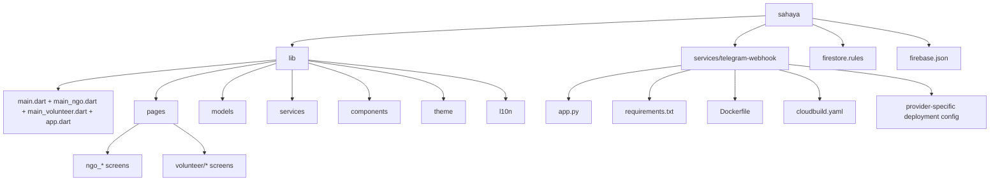

## 5. Class Diagram (Core Domain Models)

Based on concrete model definitions in:
- [lib/models/problem_card.dart](lib/models/problem_card.dart)
- [lib/models/task_model.dart](lib/models/task_model.dart)
- [lib/models/match_record.dart](lib/models/match_record.dart)
- [lib/models/volunteer_profile.dart](lib/models/volunteer_profile.dart)
- [lib/models/raw_upload.dart](lib/models/raw_upload.dart)
- [lib/models/chat_message.dart](lib/models/chat_message.dart)

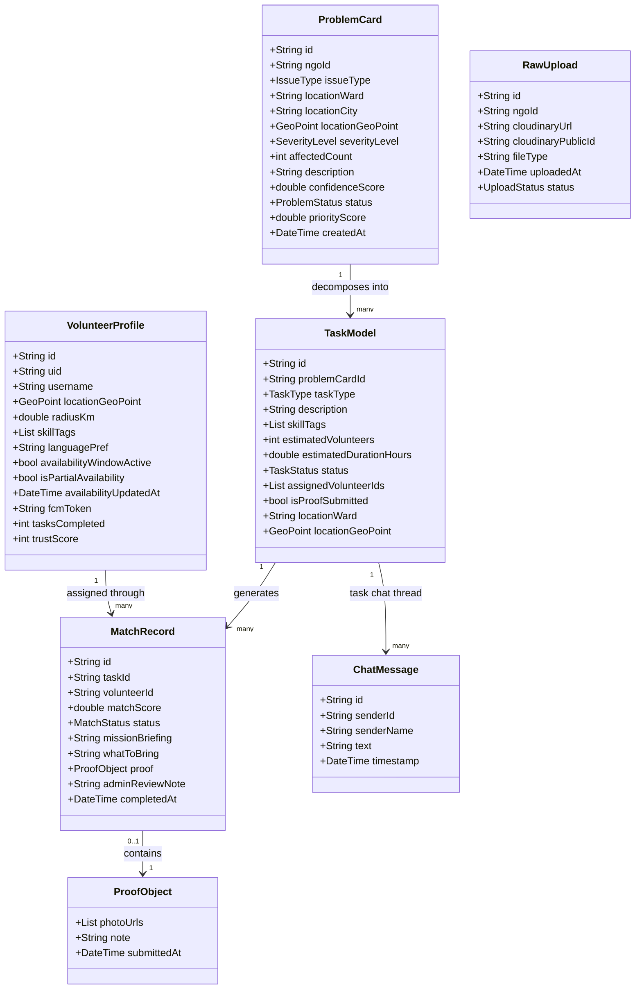

## 6. Sequence Diagrams (Key Workflows)

### 6.1 Intake -> Extraction -> Task Generation

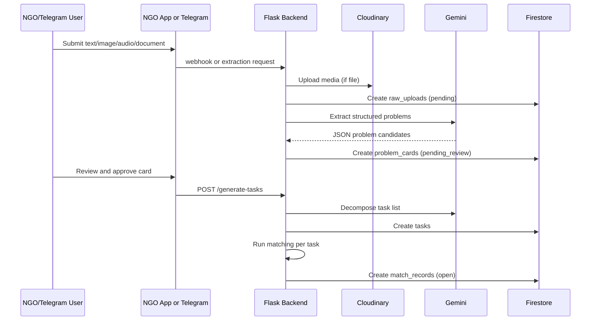

### 6.2 Proof Submit -> Auto/Manual Review -> Completion

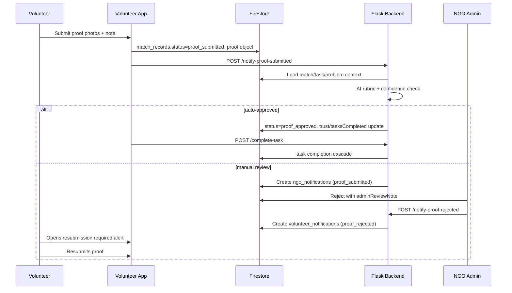

### 6.3 Offline Sync Conflict Path

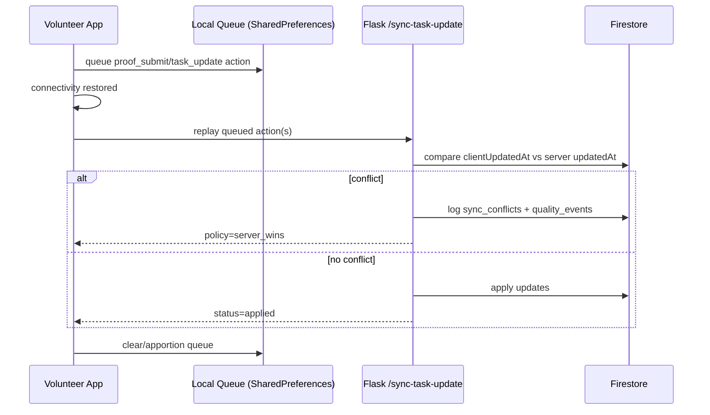

## 7. Data Flow Diagrams

### 7.1 DFD Level 0 (Context)

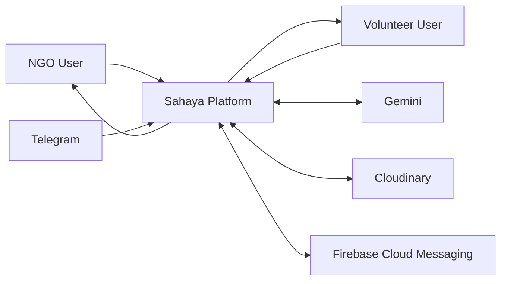

### 7.2 DFD Level 1 (Major Processes)

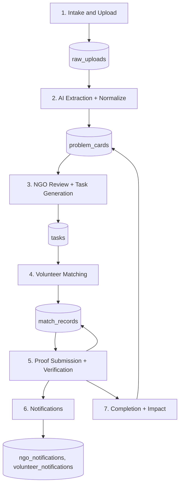

### 7.3 DFD Level 2 (Proof Verification Subsystem)

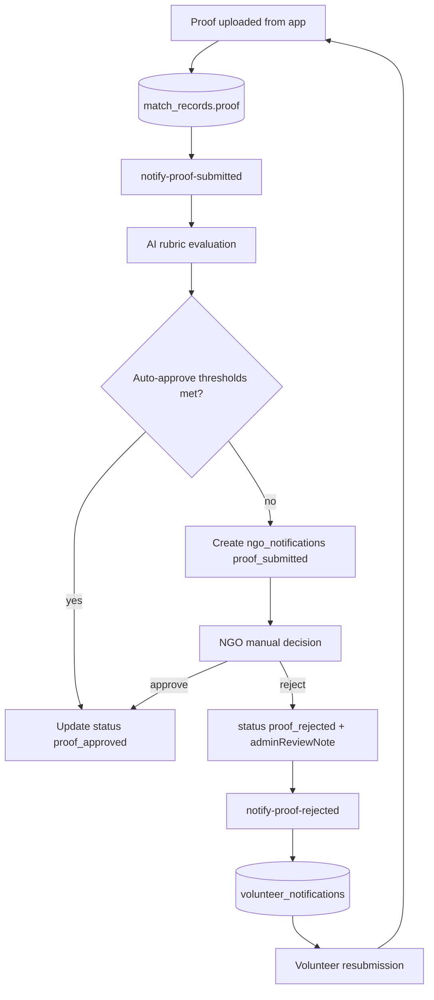

## 8. ERD for Data Models

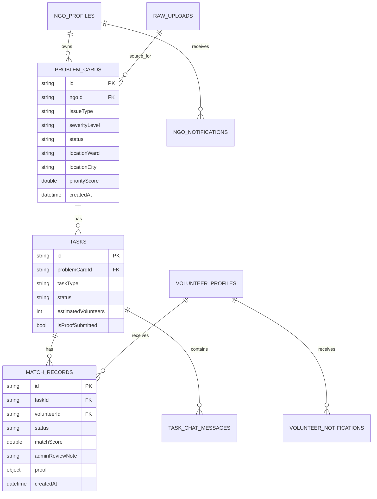

## 9. Database Schema Diagram (Firestore Collections)

```mermaid
flowchart LR
    subgraph Firestore
      U[(users)]
      NP[(ngo_profiles)]
      VP[(volunteer_profiles)]
      RU[(raw_uploads)]
      PC[(problem_cards)]
      T[(tasks)]
      MR[(match_records)]
      TN[(task_chats/{taskId}/messages)]
      NN[(ngo_notifications)]
      VN[(volunteer_notifications)]
      QE[(quality_events)]
      SC[(sync_conflicts)]
      TL[(telegram_links)]
      SR[(scenario_runs)]
    end

    NP --> PC
    PC --> T
    T --> MR
    VP --> MR
    T --> TN
    NP --> NN
    VP --> VN
    RU --> PC
    MR --> SC
    RU --> QE
```

Schema notes:
- Canonical state-bearing collections: tasks, match_records, problem_cards
- Event/audit collections: quality_events, sync_conflicts, scenario_runs
- Notification collections are role-separated for tighter read rules

## 10. API Interaction/Integration Diagram

### 10.1 Endpoint Surface (from [services/telegram-webhook/app.py](services/telegram-webhook/app.py))

| Method | Route |
|---|---|
| GET | / |
| GET | /health |
| POST | /webhook |
| POST | /generate-tasks |
| POST | /run-matching |
| POST | /redispatch-task |
| POST | /redispatch-cycle |
| POST | /sync-task-update |
| POST | /simulate-scenario |
| POST | /send-availability-reminders |
| POST | /notify-proof-submitted |
| POST | /complete-task |
| POST | /notify-proof-rejected |
| POST | /api/gemini/extract-problems |
| POST | /api/gemini/extract-problems-audio |
| POST | /api/gemini/ai-edit |
| POST | /api/gemini/ai-edit-list |

### 10.2 Integration Diagram

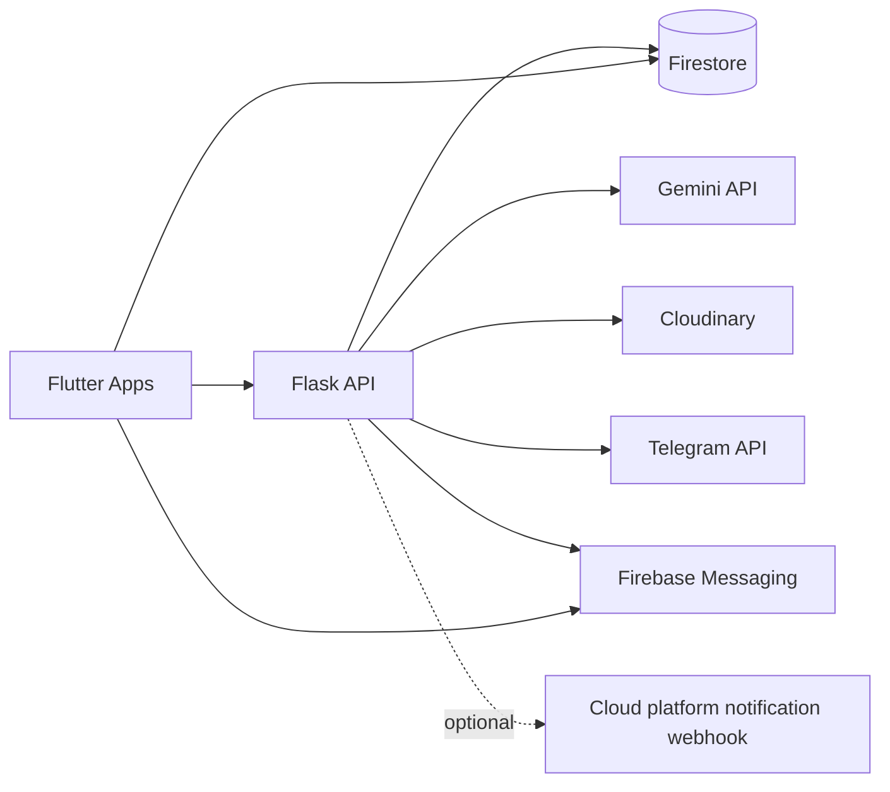

## 11. Use Case Diagram

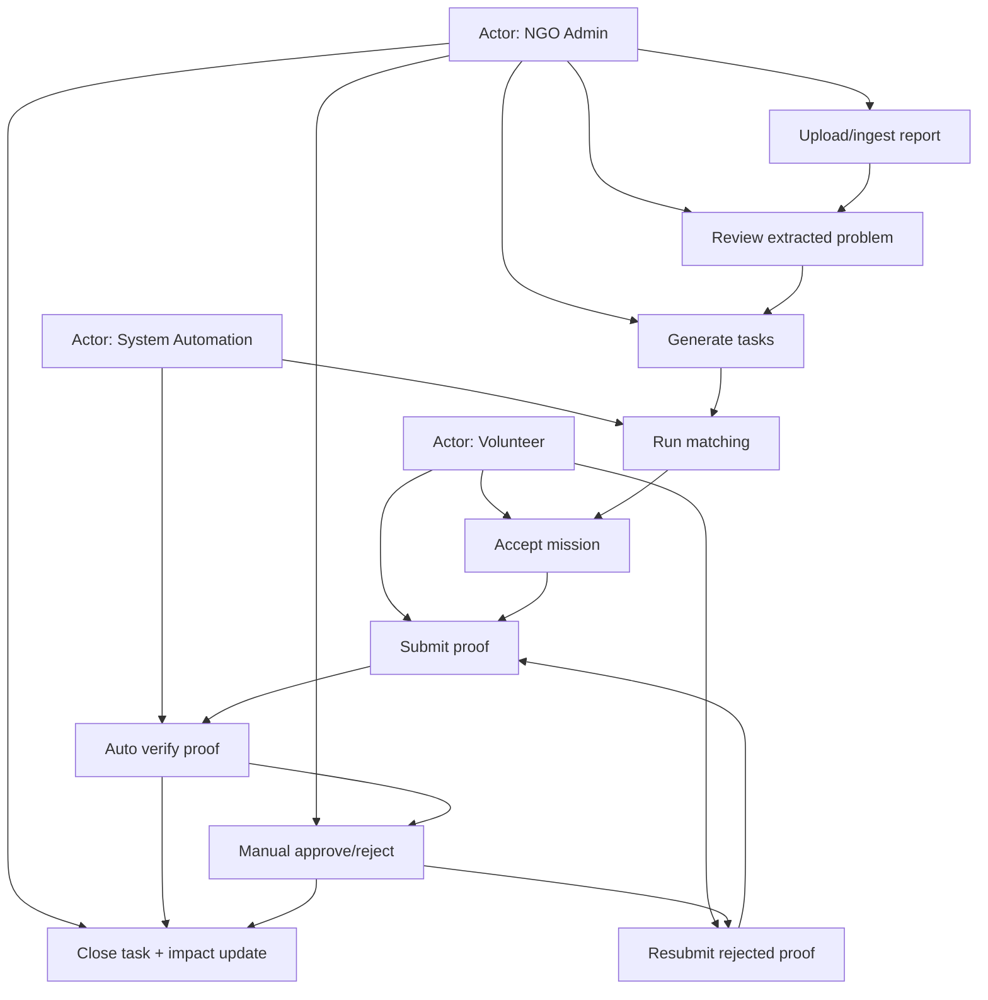

## 12. User Journey / User Flow Diagrams

### 12.1 NGO Journey

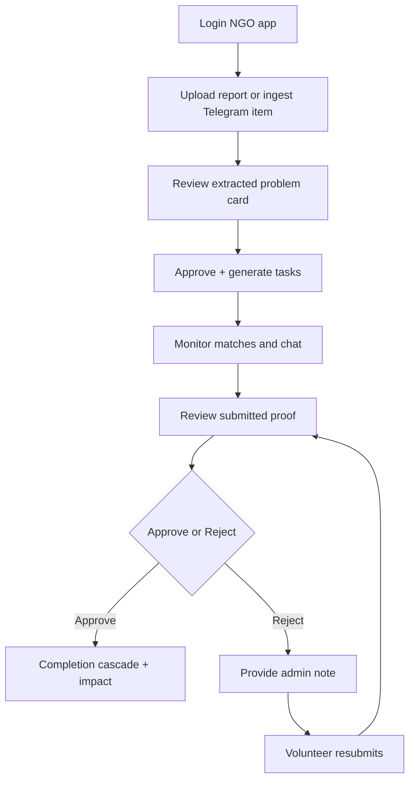

### 12.2 Volunteer Journey

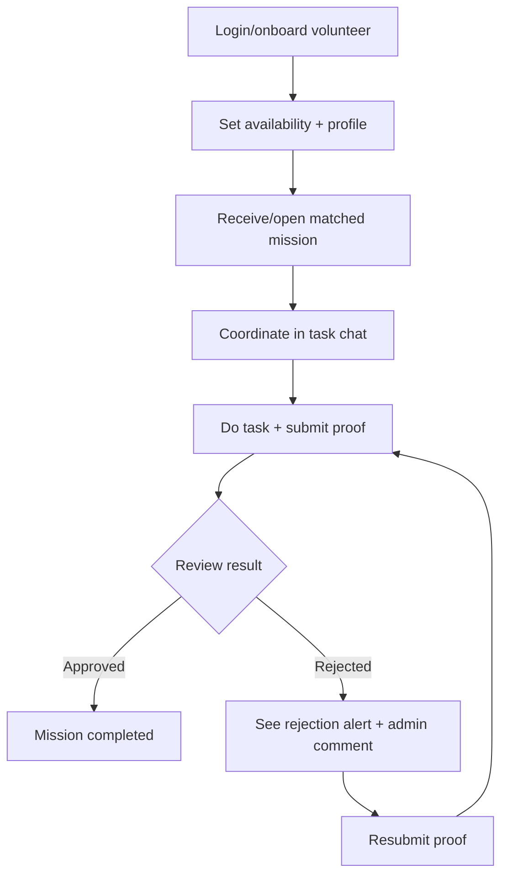

Example:
- Rejection branch now explicitly notifies volunteer and opens active mission with admin review note for guided resubmission.

## 13. State Machine / State Transition Diagrams

### 13.1 Match Record State Machine

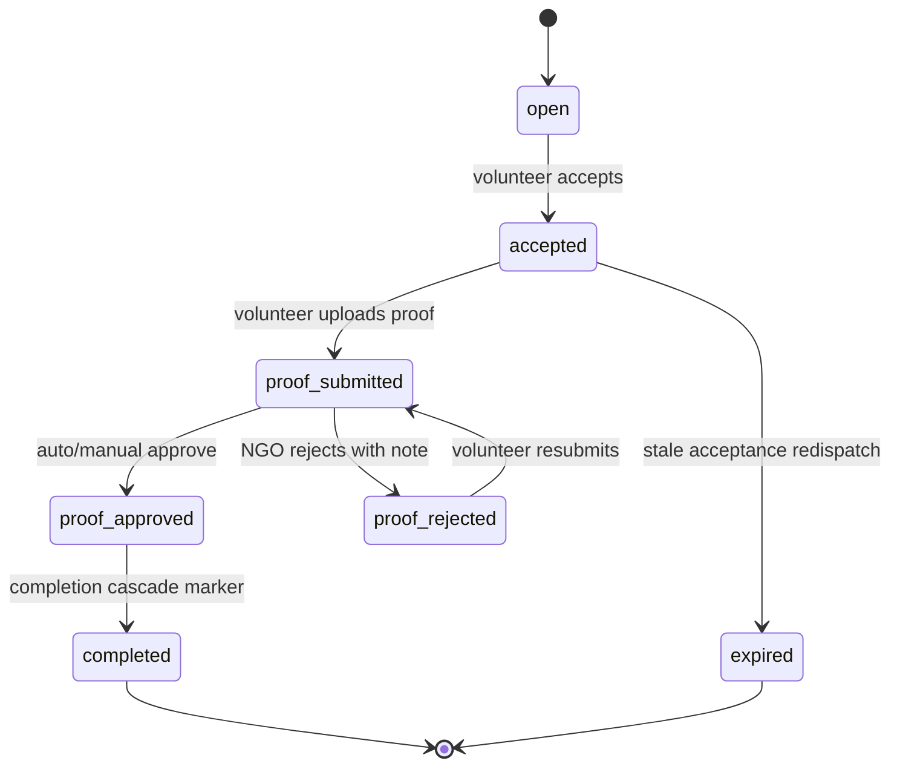

### 13.2 Task State Machine

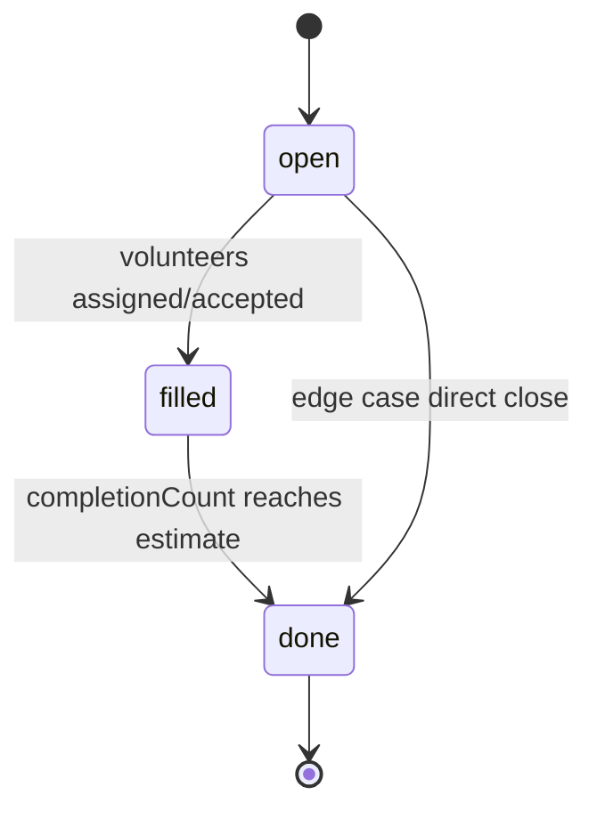

### 13.3 Notification State Machine

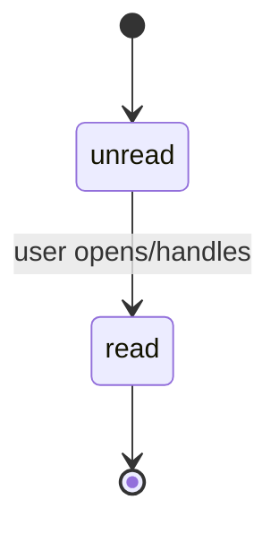

## 14. Deployment Diagram (Infrastructure and Environments)

Observed deployment artifacts:
- Containerized backend via [services/telegram-webhook/Dockerfile](services/telegram-webhook/Dockerfile)
- GCP Cloud Run pipeline via [services/telegram-webhook/cloudbuild.yaml](services/telegram-webhook/cloudbuild.yaml)
- Provider-specific cloud deployment defaults via project deployment config

```mermaid
flowchart TB
    subgraph Local
      DEV1[Flutter dev run\nngo/volunteer flavors]
      DEV2[Flask app.py]
      EMU[Optional Firebase emulators]
      DEV1 --> DEV2
      DEV1 --> EMU
      DEV2 --> EMU
    end

    subgraph ContainerBuild
      IMG[Docker image: sahaya-backend]
    end

    subgraph CloudTargets
      CRUN[Cloud target path A\ncloudbuild.yaml]
      CAPP[Cloud target path B\ncontainerized app service]
    end

    subgraph RuntimeDeps
      FS[(Firestore)]
      FCM[Firebase Messaging]
      GEM[Gemini]
      CLD[Cloudinary]
      TG[Telegram API]
      CPN[Cloud platform webhook optional]
    end

    DEV2 --> IMG
    IMG --> CRUN
    IMG --> CAPP

    CRUN --> FS
    CRUN --> FCM
    CRUN --> GEM
    CRUN --> CLD
    CRUN --> TG
    CRUN -.-> CPN

    CAPP --> FS
    CAPP --> FCM
    CAPP --> GEM
    CAPP --> CLD
    CAPP --> TG
    CAPP -.-> CPN
```

Environment notes:
- Runtime uses env vars for credentials and service endpoints in [services/telegram-webhook/app.py](services/telegram-webhook/app.py)
- Flutter apps are flavor-separated via [lib/flavors.dart](lib/flavors.dart) and entrypoints [lib/main_ngo.dart](lib/main_ngo.dart), [lib/main_volunteer.dart](lib/main_volunteer.dart)

## 15. Accuracy Notes and Boundaries

- Diagrams reflect implemented code paths and current schema usage observed in the repo.
- Firestore is schemaless; schema diagrams represent effective application-level contracts, not strict database-enforced schemas.
- Some operational policies (for example, exact production target used at this moment) can support multiple cloud deployment paths.

