# Sahaya Architecture Slide Pack

This version is optimized for presentations: concise narrative, high-signal diagrams, and cloud-platform-agnostic language.

## Slide 1: System Vision
Sahaya is an AI-assisted NGO operations platform that converts fragmented field inputs into prioritized action, volunteer dispatch, and verified completion outcomes.

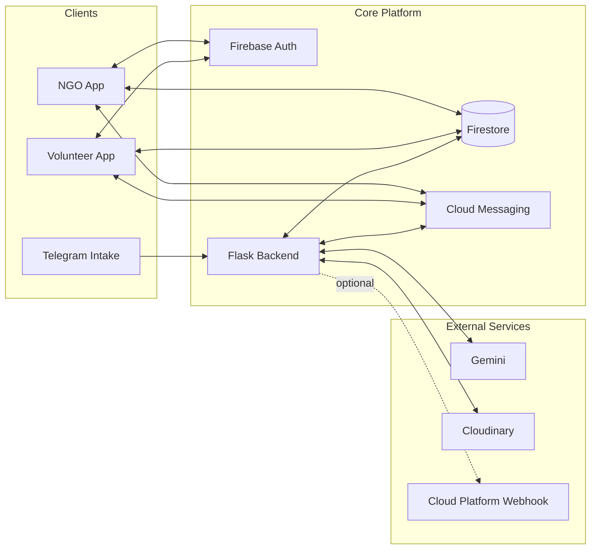

## Slide 2: End-to-End Architecture (Detailed)

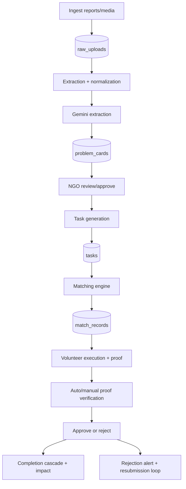

## Slide 3: Component Diagram

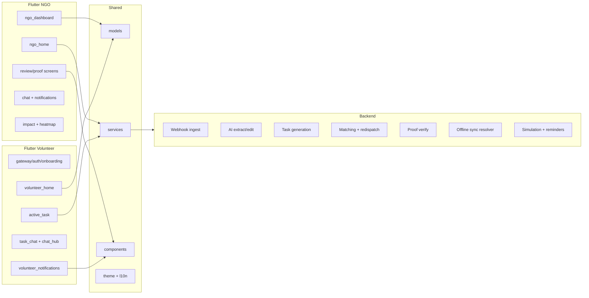

## Slide 4: Module/Package Structure

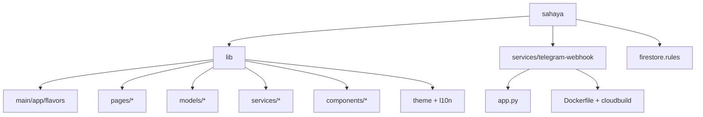

## Slide 5: Class Diagram (Core Domain)

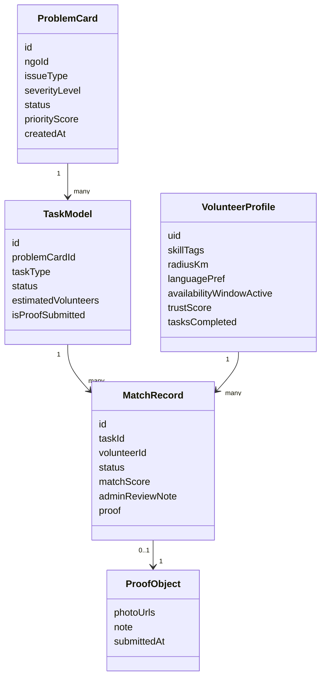

## Slide 6: Sequence - Intake to Match

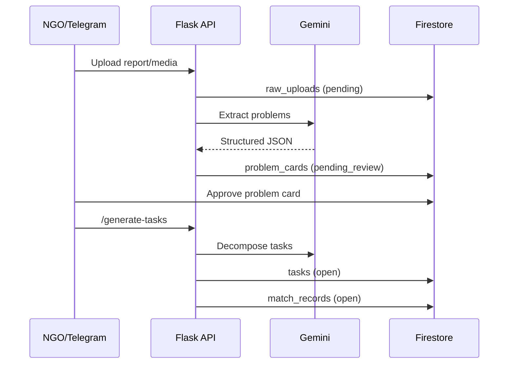

## Slide 7: Sequence - Proof Approval/Rejection Loop

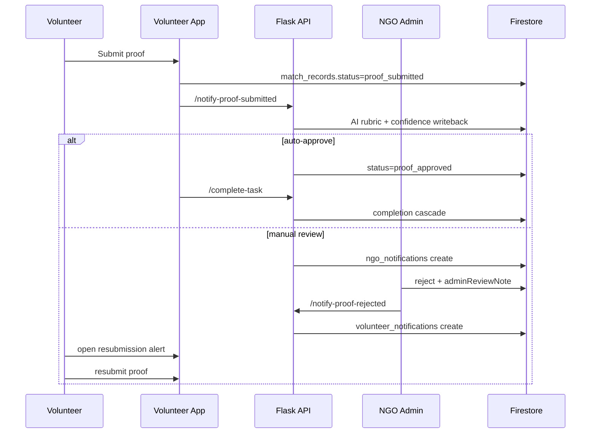

## Slide 8: DFD Level 0

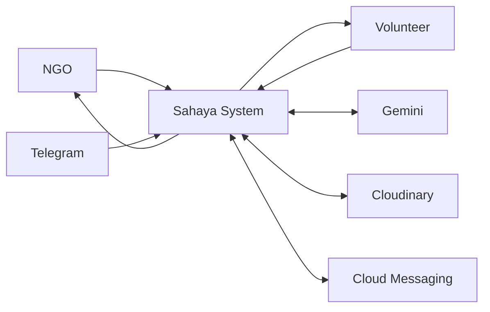

## Slide 9: DFD Level 1 and 2

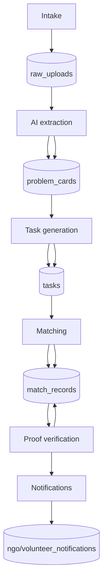

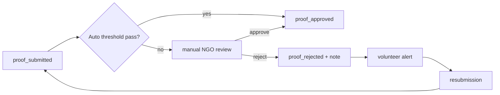

## Slide 10: ERD + Schema View

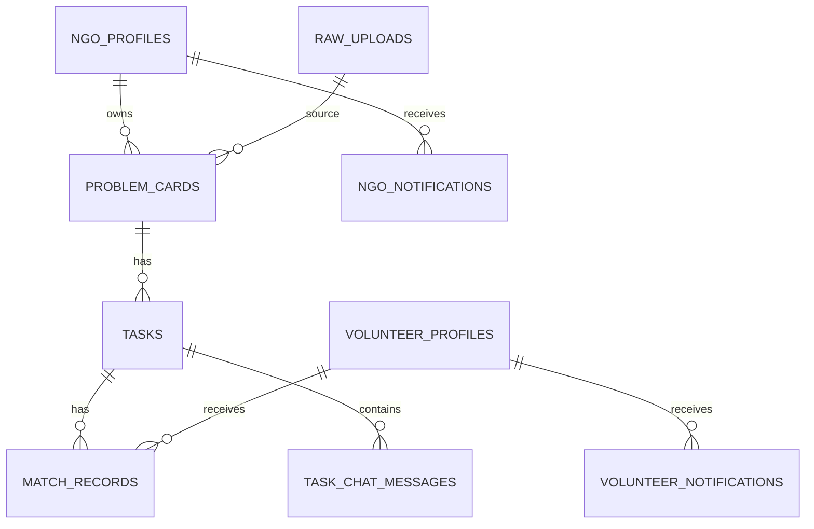

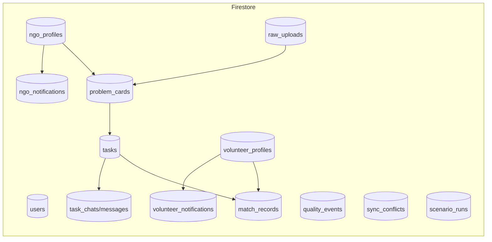

## Slide 11: API Interaction + Use Cases + User Flows

### API Interaction

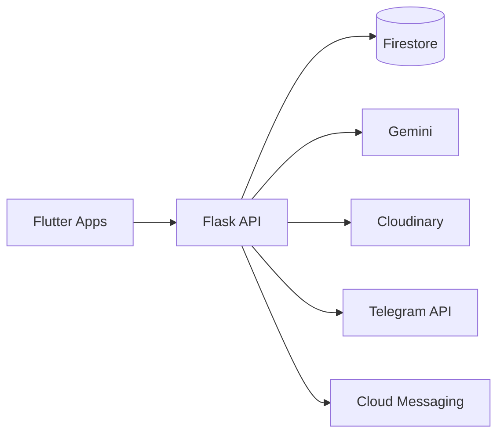

### Use Cases

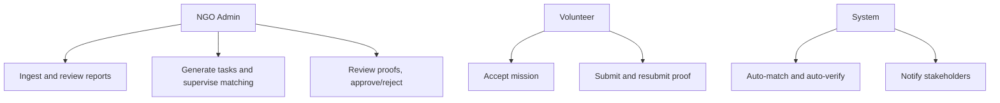

### User Flows

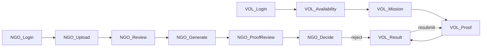

## Slide 12: State Machines

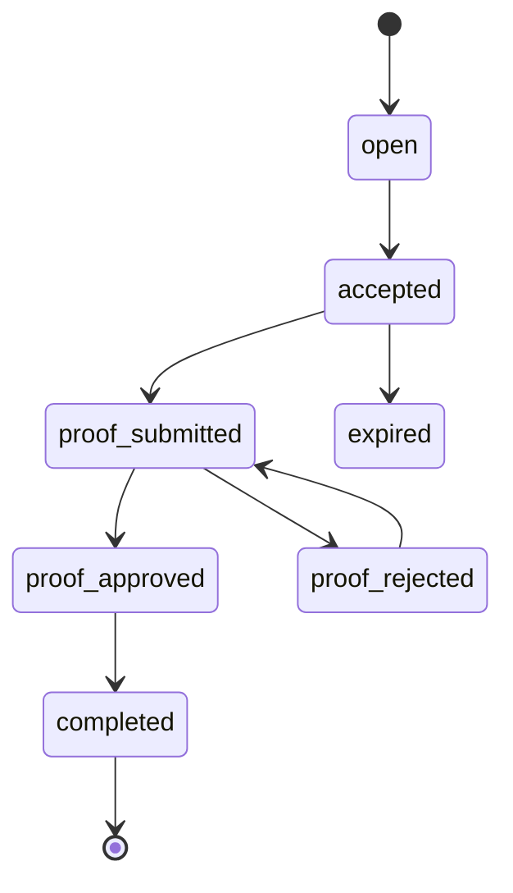

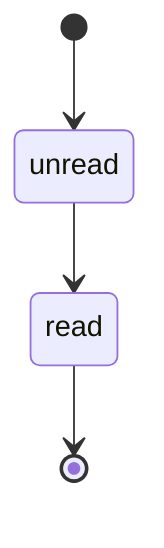

## Slide 13: Deployment Diagram (Cloud Platform Agnostic)

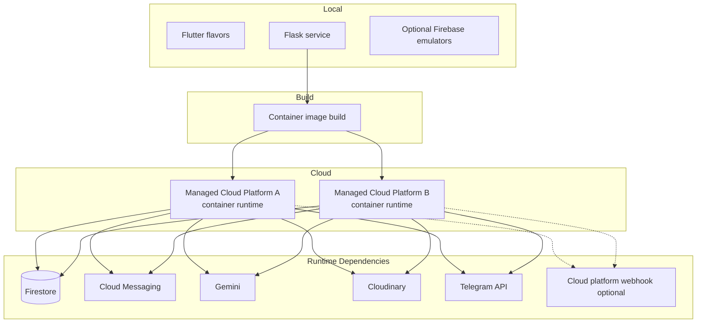

## Presenter Notes (Optional)
- Keep the narrative loop simple: intake -> intelligence -> dispatch -> verification -> measurable impact.
- Highlight deterministic safeguards around AI outputs (schema sanitization, constrained taxonomies, bounded scoring).
- Emphasize the rejection-resubmission loop and offline sync conflict policy as real-world reliability features.
